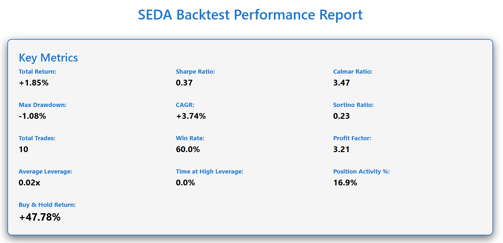
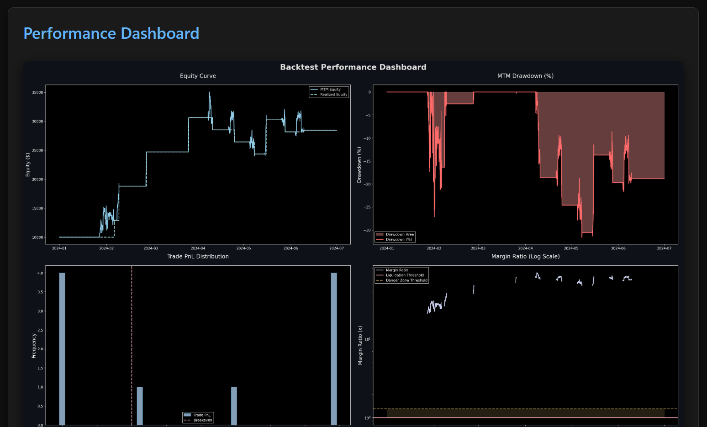

<!-- At the very top of README.md -->
<div align="center">
  <h1>SEDA — Synchronous Event-Driven Analyzer</h1>
  
  <p>
    <strong>Institutional-grade backtesting for perpetual futures</strong><br>
    Multi-asset • Multi-timeframe • Realistic execution • Leverage & liquidation
  </p>

  <p>
    <a href="https://github.com/caldog1/seda-backtester/stargazers">
      
    </a>
    <a href="https://github.com/caldog1/seda-backtester">
      
    </a>
    <a href="https://github.com/caldog1/seda-backtester/blob/main/LICENSE">
      
    </a>
    <a href="https://pypi.org/project/seda-backtester/">
      
    </a>
    <a href="https://pypi.org/project/seda-backtester/">
      
    </a>
  </p>

  <p>
    
    
  </p>
</div>

<br>

# SEDA — Synchronous Event-Driven Analyser

[](https://opensource.org/licenses/MIT)
[](https://www.python.org/downloads/)
[](https://github.com/psf/black)
[](https://pypi.org/project/seda-backtester/)

**Institutional-grade backtesting engine for perpetual futures trading strategies.**

SEDA is a high-fidelity, synchronous event-driven backtester designed specifically for multi-asset, multi-timeframe portfolio simulation in perpetual futures markets. Unlike vectorized backtesters that assume perfect fills and ignore order-book dynamics, SEDA simulates realistic execution (fees, slippage, leverage caps, liquidation risk) while preserving exact chronological order across all assets and timeframes.

Built from the ground up for accuracy, extensibility, and performance — ideal for quantitative researchers, algorithmic traders, and anyone who needs confidence that backtest results will translate to live trading.

## Why SEDA?

Most open-source backtesters fall into two categories:

- **Vectorized** (e.g., Backtrader, vectorbt): Fast but unrealistic — they assume market orders fill at close price with no slippage, ignore intra-bar liquidity, and cannot correctly simulate multi-timeframe interactions.
- **Simple event-driven** (e.g., older versions of Zipline): Better realism but often single-asset, slow, or lacking modern perpetual-futures features (leverage, funding rates, liquidation).

SEDA combines the best of both worlds:

- True synchronous event-driven simulation across unlimited assets and timeframes
- Realistic execution modeling (taker/maker fees, volume-based slippage, limit order support)
- Full perpetual-futures risk engine (leverage caps, maintenance margin, liquidation tracking)
- High-performance NumPy core with minimal Python overhead
- Clean, type-annotated, dataclass-heavy codebase — easy to read, extend, and maintain
- Built-in Optuna optimization with data pre-loading for speed
- Beautiful standalone HTML reports with embedded Matplotlib dashboards

## Key Features

- **Synchronous multi-asset / multi-timeframe** portfolio simulation
- **Realistic order execution**:
  - Taker/maker fee tiers
  - Hybrid slippage model (fixed noise + volume-share component)
  - Limit order support (no slippage, maker fees)
- **Perpetual futures risk management**:
  - Configurable max leverage
  - Maintenance margin ratio
  - Liquidation detection (log, stop, or future force-close modes)
- **Position sizing abstractions** (fixed notional, fractional, risk-based, Kelly)
- **Rich reporting**:
  - Console summary
  - Standalone HTML report with configuration, metrics, trade analysis, rolling stats, and embedded plots
- **Optuna integration** with automatic best-trial backtest and visualizations
- **Extensible architecture**:
  - Pluggable data providers (CSV included, Binance/CCXT ready)
  - Clean strategy base class with automatic SL/TP handling
- **Zero external runtime dependencies** beyond NumPy, Pandas, Matplotlib, and Optuna (optional)

## Important Disclaimer

**SEDA is research and educational software provided "as is" under the MIT License.**

- This project is **under active development**. While the core engine is stable and thoroughly designed, it is **not exhaustively tested** in all edge cases. Bugs, inaccuracies, or unexpected behavior may occur.
- **Backtested results are hypothetical and not indicative of future performance**. Past performance does not guarantee future results.
- Trading cryptocurrencies or perpetual futures involves **substantial risk of loss** and is not suitable for everyone. You alone are responsible for evaluating the risks and merits of any strategy.
- The author and contributors provide **no warranties** (expressed or implied) regarding accuracy, completeness, or profitability. Use this software **entirely at your own risk**.
- SEDA is **not financial advice**, and nothing in this repository should be construed as investment recommendations.

Always validate strategies with out-of-sample testing, walk-forward analysis, and (if possible) paper/live trading before risking real capital.

## Installation

The easiest way to install SEDA is directly from PyPI:

```bash
pip install seda-backtester
````
Optional dependencies for optimization and advanced reporting:
```bash
pip install optuna plotly kaleido  # for Optuna visualizations
```
## Quickstart

Create a minimal script (e.g., simple_sma_backtest.py):

```Python
from datetime import datetime

from backtester.core.engine import Backtester
from backtester.strategies.sma_crossover import SMACrossoverStrategy
from backtester.sizers.sizers import FixedNotionalSizer
from backtester.reporting.reporter import Reporter

if __name__ == "__main__":
  strategy = SMACrossoverStrategy(
    name="SMA Crossover",
    fast_period=50,
    slow_period=200,
    sizer=FixedNotionalSizer(notional=100_000),
  )

  bt = Backtester(
    timeframes=["1h"],
    asset_list=["BTCUSDT"],
    strategies=[strategy],
    start_date=datetime(2023, 1, 1),
    end_date=datetime(2024, 12, 1),
    initial_capital=100_000,
    leverage=5.0,
    custom_filepaths={
        "BTCUSDT_1h": "path/to/your/BTCUSDT_1h.csv",  # <-- replace with your real CSV path
        # Alternative tuple format (also supported):
        # ("BTCUSDT", "1h"): "path/to/your/BTCUSDT_1h.csv",
    },
  )

  results = bt.run()
  Reporter(results, bt).generate_report(format="html", output_path="reports/quickstart.html")
  Reporter(results, bt).generate_report(format="console")
```
Run it:
```bash
python simple_sma_backtest.py
```
Open reports/quickstart.html to view the professional performance report.

## Examples

The `examples/` directory contains ready-to-run demonstrations:

- `simple_sma_backtest.py` — Minimal quickstart with SMA crossover
- `optimization_demo.py` — End-to-end Optuna hyperparameter optimization with visualizations
- `multi_asset_portfolio.py` — Simultaneous BTCUSDT + ETHUSDT simulation across 1h and 4h timeframes

Additional fully-commented strategy templates (ready for extension or optimization):

- `src/backtester/strategies/rsi_mean_reversion.py`
- `src/backtester/strategies/bollinger_breakout.py`
- `src/backtester/strategies/sma_crossover.py`

Every example generates a rich standalone HTML report that showcases SEDA’s professional-grade reporting capabilities.

### Example Report




*Full interactive reports generated automatically — multiple themes supported.*

## Architecture Overview
```
seda-backtester/
├── src/
│   └── backtester/               # Importable package
│       ├── init.py
│       ├── core/                 # Simulation engine, results, trade objects, liquidation tracker
│       ├── data/                 # Pluggable data providers (CSV + abstract base)
│       ├── execution/            # Fee models, slippage models, centralised order execution
│       ├── reporting/            # Console summaries + standalone HTML reports with Matplotlib dashboards
│       ├── sizers/               # Position sizing abstractions (fixed, fractional, risk-based, Kelly)
│       ├── strategies/           # Base Strategy class + fully-documented example strategies
│       └── optimisation/         # Optuna integration with data pre-loading for speed
├── examples/                     # Ready-to-run demonstration scripts
├── tests/                        # Unit and integration tests
├── sample_data/                  # Example OHLCV CSV files (BTCUSDT_1h.csv, etc.)
├── reports/                      # Generated HTML report examples (optional but recommended to commit a few)
├── pyproject.toml                # Modern packaging configuration
├── README.md
├── LICENSE
└── .gitignore

```
The engine follows a strict separation of concerns for maintainability and extensibility:

1. **Data loading** → build a unified chronological timeline across all assets and timeframes  
2. **Simulation loop** → exits processed before entries each bar (correct capital allocation)  
3. **Execution** → centralised realistic fee and slippage application  
4. **Risk engine** → leverage caps, maintenance margin, liquidation detection  
5. **Reporting** → vectorised performance metrics + rich Matplotlib visualisations

1. **Data loading** → unified chronological timeline across all assets/timeframes  
2. **Simulation loop** → exits processed before entries, precise portfolio state updates  
3. **Execution** → centralized realistic fee + slippage application  
4. **Risk engine** → leverage caps, maintenance margin, liquidation detection  
5. **Reporting** → vectorized metric calculation + Matplotlib dashboards

## Developing Strategies

Extend the abstract `Strategy` class from `src.backtester.strategies.base`. The base class handles trade tracking, position sizing, pyramiding control, and automatic SL/TP enforcement.

```python
from backtester.strategies.base import Strategy
from backtester.core.order import Order
from backtester.core.trade import TradeDirection

class MyStrategy(Strategy):
    def handle_entries(
        self,
        key,
        idx,
        arrays,
        timeframe,
        asset,
        current_equity,
        max_additional_notional,
        backtester,
    ) -> list[Order]:
        # Emit Order objects when your signal fires
        # The engine will apply sizing, execution, and risk checks
        ...

    def check_exit(
        self,
        idx: int,
        trade: Trade,
        arrays: dict,
        asset: str,
        timeframe: str,
        backtester: "Backtester",
    ) -> ExitDecision:
        # Optional custom exit logic (trailing stops, signals, etc.)
        # Return ExitDecision(False, ...) to keep position open
        ...
```
See `rsi_mean_reversion.py` and `bollinger_breakout.py` for complete, heavily-commented templates.
Strategies become instantly optimizable by defining a Params dataclass with a nested Meta class specifying search ranges for Optuna.
## Data Requirements

SEDA uses standard OHLCV CSV files:
- Columns: `timestamp` (index), `open`, `high`, `low`, `close`, `volume`
- File naming: `{asset}_{timeframe}.csv` (e.g., `BTCUSDT_1h.csv`)

The package does **not** include sample data (keeps install lightweight).

### Options for Data

1. **Use your own CSVs** (recommended for real strategies):
   Pass paths explicitly:
   ```python
    bt = Backtester(
        ...,
        # === DATA OPTIONS ===
        # For development/testing (when running from cloned repo):
        # custom_filepaths=None,  # uses default data_root = "../sample_data"
        # data_root="../sample_data",  # explicit (optional)
      
        # For production / pip-installed usage (recommended):
        custom_filepaths={
            "BTCUSDT_1h": "path/to/your/BTCUSDT_1h.csv",  # <-- replace with your real CSV path
            # Alternative tuple format (also supported):
            # ("BTCUSDT", "1h"): "path/to/your/BTCUSDT_1h.csv",
        },
    )
## Data Providers
The included CSV provider features automatic column detection and supports arbitrary file naming via the custom_filepaths argument.
Live data sources (Binance API, CCXT, etc.) can be added by implementing the lightweight DataProvider abstract interface — no changes to the core engine required.
## Optimization
```bash
pip install "seda-backtester[optimization]"
```
`examples/optimization_demo.py` shows the complete workflow. The Optimizer class pre-loads all data once for dramatic speed improvements and supports sophisticated composite objectives (e.g., Calmar × Sharpe², SQN, expectancy-adjusted metrics).
## Contributing
Contributions are very welcome! Please follow these guidelines:

Format code with Black
Use comprehensive type hints
Add tests where possible (full test suite in development)
Open an issue first for significant features or refactors

## License
MIT License — free for commercial or personal use, modification, and distribution.
Acknowledgments
SEDA was created to address the lack of a modern, realistic, and maintainable open-source backtester tailored to perpetual futures trading. It prioritises production-grade accuracy, type safety, clean architecture, and extensibility.

Made by Callum Cruikshank 

Questions or feedback? Open an issue or reach out on X.